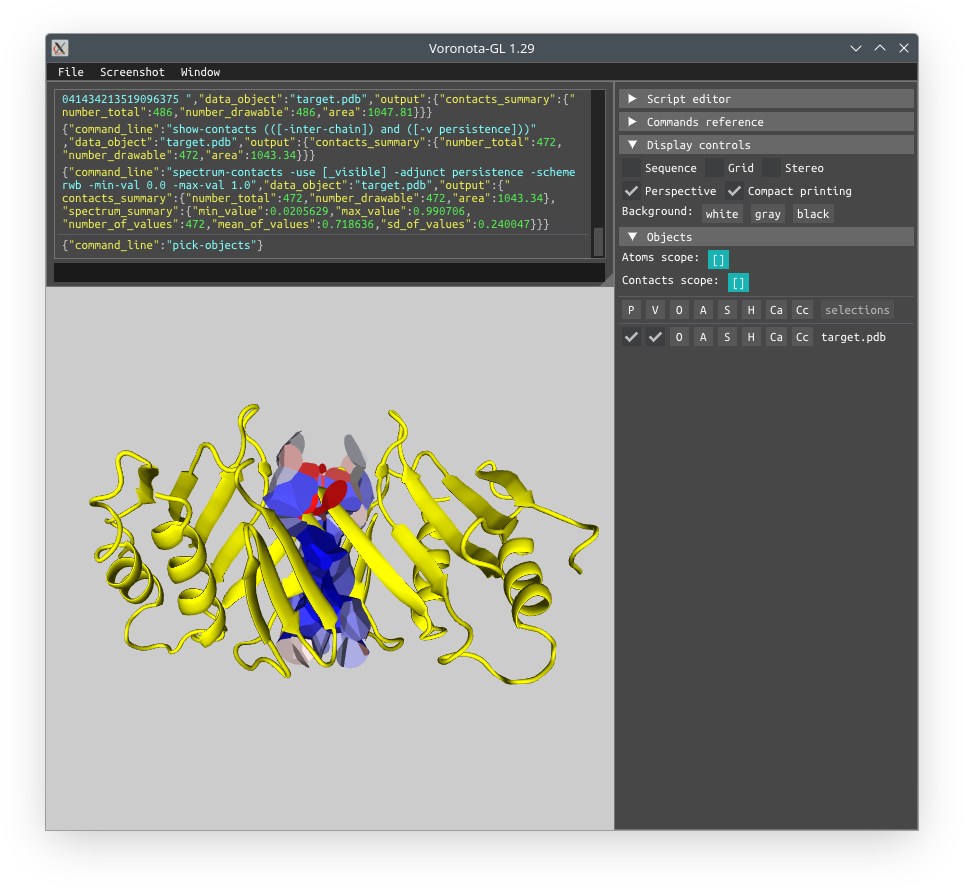
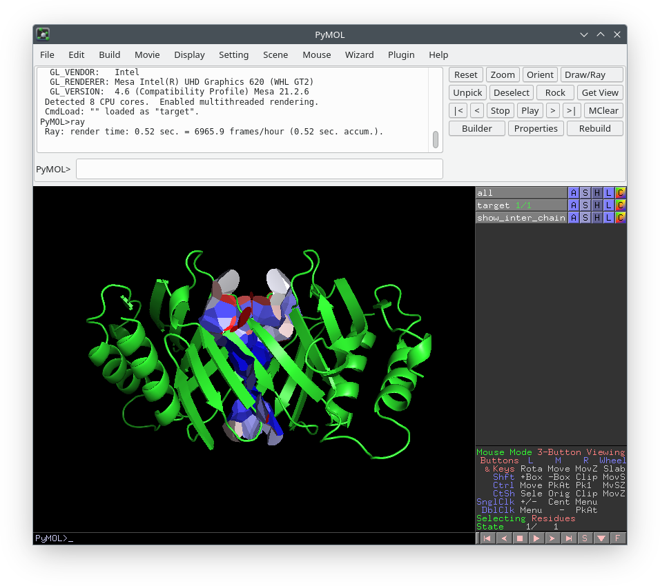

# About VoroMarmotte

VoroMarmotte is method to predict whether Voronoi tessellation-derived contact areas
observed in a single conformation of a protein are likely to persist (remain stable) or not persist (decrease in area)
in an ensemble of multiple conformations of the same protein.
In other words, VoroMarmotte predicts contact area heterogeneity from a single input structure.

VoroMarmotte is developed as one of the results of the MARMOTTTE project.
The details of the method are to be published soon.
This repository provides an alpha version of VoroMarmotte app.

VoroMarmotte is developed by Kliment Olechnovic ([www.kliment.lt](https://www.kliment.lt)).

# Obtaining and setting up VoroMarmotte

## Getting the latest version

The currently recommended way to obtain VoroMarmotte is cloning the VoroMarmotte git repository [https://github.com/kliment-olechnovic/voromarmotte-app](https://github.com/kliment-olechnovic/voromarmotte-app):

```bash
git clone https://github.com/kliment-olechnovic/voromarmotte-app.git
cd ./voromarmotte-app
```

## Building the included software

VoroMarmotte comes with statically built binaries for Linux in the 'tools' subdirectory.

The source code for the compilable software is included, and can be used to build all the needed executable with the following single command: 

```bash
./tools/build-all.bash
```

## Setting up an environment for running VoroMarmotte

VoroMarmotte requires PyTorch, NumPy, and R.

Below is an example of setting up a suitable environment:

```bash
# install and activate Miniconda
wget https://repo.anaconda.com/miniconda/Miniconda3-latest-Linux-x86_64.sh
bash Miniconda3-latest-Linux-x86_64.sh
source ~/miniconda3/bin/activate

# import and activate provided environment
conda env create --file ./env/voromarmotte-env.yaml
conda activate voromarmotte-env

# if you do not have R installed in your system, install it (below is an example for Ubuntu)
sudo apt-get install r-base
```

### Optionally, setting up an environment for relaxing with OpenMM

In case the `--relax-with-openmm` option will be used, an environment for running OpenMM can be set up:

```bash
conda env create --file ./env/openmm-env.yaml
```

# Running the VoroMarmotte command-line tool

The overview of command-line options, as well as input and output, is printed when running the "voromarmotte" executable with "--help" or "-h" flags:

```bash
voromarmotte --help

voromarmotte -h
```

The following is the help message output:

```

'voromarmotte' predicts persistence of contact areas in a protein structure

Options:
    --input | -i              string  *  input file path or '_list' to read file paths from stdin
    --conda-path              string     conda installation path, default is '${HOME}/miniconda3'
    --conda-env               string     conda environment name, default is 'voromarmotte-env'
    --rebuild-sidechains      string     flag to rebuild side-chains with FASPR, can be 'false' or 'true', default is 'false'
    --mutate-sidechains       string     triples of strings (chain resnum resname) to define mutations and rebuild with FASPR
    --relax-with-openmm       string     parameters (':'-separated tokens, or 'basic') to enable the OpenMM relaxation, default is ''
    --subselect-contacts      string     query to subselect inter-chain contacts, default is '[]'
    --output-per-contact      string     output file path for the table of per-contact scores, default is ''
    --output-per-residue      string     output file path for the table of per-residue summary scores, default is ''
    --output-table-file       string     output file path for the global scores, default is '_stdout'
    --output-vscript          string     output file path for the visualization script for Voronota-GL
    --output-pymol-vscript    string     output file path for the visualization script for PyMol
    --processors              number     maximum number of processors to run in parallel, default is 1
    --help | -h                          flag to display help message and exit

Standard output:
    space-separated table of global scores

Examples:

    ./voromarmotte  --input ./model.pdb --conda-path ~/miniconda3 --conda-env 'voromarmotte-env' > ./table.txt
    
    ./voromarmotte  --input ./model.pdb --subselect-contacts '[-inter-chain]' > ./table.txt
    
    ./voromarmotte  --input ./model.pdb --output-per-contact ./table_of_contacts.txt > ./table.txt
    
    find ./models/ -type f -name '*.pdb' | ./voromarmotte --input _list --subselect-contacts '[-inter-chain]' > ./table.txt
    
```

# Output example

Running

```bash
find "./tests/input/" -type f -name '*.pdb' \
| ./voromarmotte \
  --input _list \
  --conda-path ~/miniconda3 \
  --conda-env "voromarmotte-env" \
  --processors 4 \
  --subselect-contacts "[-inter-chain]"
```

gives

```
ID          area_pseudoenergy  area_total  area_expected_to_persist  area_goodness_pseudoenergy  best_core_pseudoenergy  best_core_area
target.pdb  -1330.24266560559  1043.34122  736.036934416612          -1836.75303518038           -1465.40963660073       963.03436
model2.pdb  -192.57424709485   971.6527    514.899135986745          -990.634743868687           -478.757485155433       732.5084
model1.pdb  572.000273266142   972.36053   399.674485370467          -668.186200634224           -17.1140646562708       721.16258
```

# Visualization example

Running

```bash
./voromarmotte \
  --input "./tests/input/target.pdb" \
  --conda-path ~/miniconda3 \
  --conda-env "voromarmotte-env" \
  --subselect-contacts "[-inter-chain]" \
  --output-vscript "show_inter_chain_interface.vs" \
  --output-pymol-vscript "show_inter_chain_interface.py"
```

output scores and generates two visualiztion scripts: "show_inter_chain_interface.vs" and "show_inter_chain_interface.py" for PyMol.

The "show_interface.vs" script is to be run by Voronota-GL after loading the input structure:

```bash
voronota-gl "./tests/input/target.pdb" "show_inter_chain_interface.vs"
```



The "show_interface.py" script is to be run by PyMol (should work with both 'pymol' and 'pymol-oss.pymol'):

```bash
pymol-oss.pymol "./tests/input/target.pdb" "show_inter_chain_interface.py"
```




