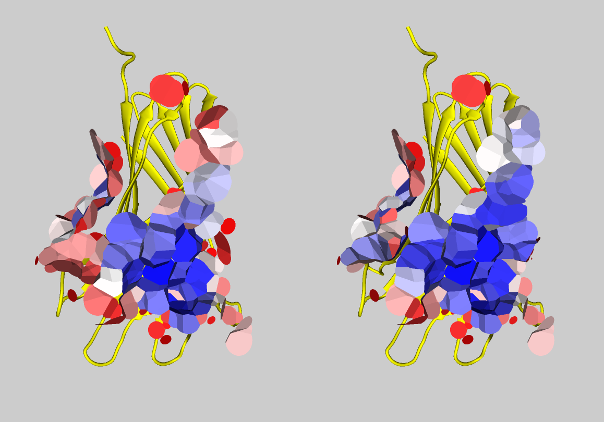

# Analyzing binders

## Calculating baseline scores

Let's analyze three AF2 models of protein-protein complexes with designed binders in the [input directory](./input/).

We can run VoroMarmotte to get both global and inter-chain (ic_...) scores using a single command.
Let's tell VoroMarmotte to rebuild sidechains using FASPR, and let's consider only contacts involving the binder (chain A).

```bash
find ./input/ -type f -name '*.pdb' \
| ../../voromarmotte \
  --input _list \
  --rebuild-sidechains "true" \
  --subselect-contacts '[-a1 [-chain A]]' \
  --processors 3
```
This produces the following table:

```
ID           modified  pseudoenergy            area                  best_core_pseudoenergy  best_core_area        ic_fraction        ic_area_pseudoenergy  ic_area_total         ic_best_core_pseudoenergy  ic_best_core_area
design1.pdb  rebuilt   -11813.987477169581325  9349.444120000011026  -12266.914771829280653  9044.613930000010441  0.132961795807813  -420.466473588740143  1243.118879999999990  -716.137148729162845       855.597900000000323
design2.pdb  rebuilt   -9067.312684056138096   7375.054970000000139  -9778.557293821704661   6420.207669999997051  0.187249405681379  -314.328949022415713  1380.974660000000313  -886.622354313371943       688.603849999999852
design3.pdb  rebuilt   -233.506189086371705    2956.766829999999118  -1397.724229696076918   1608.509550000000445  0.426185899143085  609.737680109847361   1260.132329999999229  -395.248697797417776       490.549530000000118
```

The 'best_core_...' values show what scores can theoretically be achieved if sort the contact areas by their exposure to solvent and start removing them starting from the most exposed ones until we get the minimum pseudoenergy. Such 'best_core_...' values indicate how the 'rim' of contacts affect the overall stability and whether there is any potential for the improvement of pseudoenergy by mutating rim-involved parts.

## Finding mutations that improve interface pseudo-energy

Now, for every initial input structure, let us use VoroMarmotte to suggest mutations of the residues of chain A that improve interface pseudoenergy:

```bash
find ./input/ -type f -name '*.pdb' \
| while read -r STRUCTFILE
do
	STRUCTNAME="$(basename ${STRUCTFILE} .pdb)"

	../../voromarmotte \
	  --input "$STRUCTFILE" \
	  --subselect-contacts '[-a1 [-chain A]]' \
	  --mutate-sidechains 'stabilize-interface-A-1000-8' \
	  --output-table-file "./output/suggested_mutations_to_increase_binding_stability/${STRUCTNAME}/global_scores_of_mutations.txt" \
	  --processors 16
done
```

The `stabilize-interface-A-1000-8` specifier in the above code orders the following process:

* exaustively generate and score every single-point mutation of the chain A residues that participate in inter-chain interfaces;
* use the scores of the single-point mutations to generate 1000 multi-point mutations, with every multi-point mutation consisting of up to 8 single-point mutations;
* score every of the generated multi-point mutations;
* return the table of all the results (including both single-point and multi-point mutations), ordered by the `ic_area_pseudoenergy` column.

The links to the produces result tables are:
[results for design1](./output/suggested_mutations_to_increase_binding_stability/design1/global_scores_of_mutations.txt),
[results for design2](./output/suggested_mutations_to_increase_binding_stability/design2/global_scores_of_mutations.txt),
[results for design3](./output/suggested_mutations_to_increase_binding_stability/design3/global_scores_of_mutations.txt).

The first several lines of the generated table for `design2.pdb` are shown below:

```
ID           modified                                                                           pseudoenergy           area                  best_core_pseudoenergy  best_core_area        ic_fraction        ic_area_pseudoenergy  ic_area_total         ic_best_core_pseudoenergy  ic_best_core_area
design2.pdb  rebuilt_mutated_A_104_ARG_A_63_ASP_A_76_LEU_A_77_TYR                               -9962.183603291099644  7350.353430000002845  -10630.708657735194720  6444.605290000004061  0.189165292967416  -872.168443026431305  1390.431759999999940  -1190.843848130063407      1076.799179999999751
design2.pdb  rebuilt_mutated_A_104_ARG_A_136_TRP_A_76_LEU_A_77_TYR_A_63_SER                     -9906.141981339163976  7369.241269999999531  -10534.420925778184028  6527.215739999997822  0.191087754954181  -853.174299517867780  1408.171769999999697  -1175.925978601211682      950.932529999999815
design2.pdb  rebuilt_mutated_A_76_ARG_A_63_ASP_A_136_TRP_A_45_THR                               -9761.555122083042079  7341.766099999997095  -10392.091372066395706  6496.894409999998970  0.189960177293036  -838.143244368075557  1394.643190000000232  -1193.104308061960865      1003.203879999999799
design2.pdb  rebuilt_mutated_A_76_TYR_A_63_ASP_A_123_GLN_A_104_PRO                              -9795.980499610242987  7306.725090000004457  -10373.428917990395348  6330.082610000002205  0.185087033293598  -828.204245264516317  1352.380070000000387  -1152.991543179842438      909.359839999999849
design2.pdb  rebuilt_mutated_A_76_TYR_A_136_TRP_A_63_PRO_A_129_ILE                              -9835.193444152073425  7380.524350000002414  -10469.764219664142729  6457.565799999997580  0.194603105672295  -824.943370618210679  1436.272959999999784  -1191.181109562096253      970.384959999999865
design2.pdb  rebuilt_mutated_A_76_LEU_A_63_ARG_A_123_SER_A_35_TYR_A_60_TRP                      -9858.398618106210051  7395.937210000000050  -10447.415440228634907  6483.702080000000024  0.184595081222979  -822.724891815579440  1365.253630000000385  -1107.054853987016259      828.722659999999792
design2.pdb  rebuilt_mutated_A_76_PHE_A_71_TYR_A_123_GLY_A_35_TYR_A_75_ILE                      -9841.330348447461802  7363.342070000005151  -10455.121829619756681  6513.946700000003148  0.186042193473703  -818.331398184860177  1369.892310000000634  -1132.039891134561913      906.096889999999917
design2.pdb  rebuilt_mutated_A_76_TYR_A_63_ASP_A_129_THR_A_77_HIS                               -9766.736477548985931  7307.177750000002561  -10341.077703745613690  6425.803300000000490  0.190234969992348  -817.616191316647814  1390.080740000000333  -1179.657399739766788      916.204629999999952
````

Interestingly, mutations have improved the inter-chain VoroMarmotte scores significantly compared to the non-mutated scoring result.

Also interestingly, the interface in `design2.pdb` was improved more then the inerface in `design1.pdb` that was initially assessed to be better.

## Visualizing impacts of mutations

We can run VoroMarmotte to generate files to visualize the interface of an interesting mutant, for example:

```bash
../../voromarmotte \
  --input "./input/design2.pdb" \
  --mutate-sidechains "A_104_ARG_A_63_ASP_A_76_LEU_A_77_TYR" \
  --subselect-contacts '[-inter-chain]' \
  --output-vscript "show.vs" \
  --output-pymol-vscript "show.py" \
  --output-atoms-file "mutant_atoms.pdb" \
> "interface_scores.txt"
```

Below are `design2.pdb` interfaces before and after the mutations, showed together with chain A and colored by pseudo-energy - blue for negative (good), red for positive (bad):



Obviously, we cannot expect to turn every contact blue with just four mutations - more mutations can help, although we probably must be cautious to not break the structure with them.

