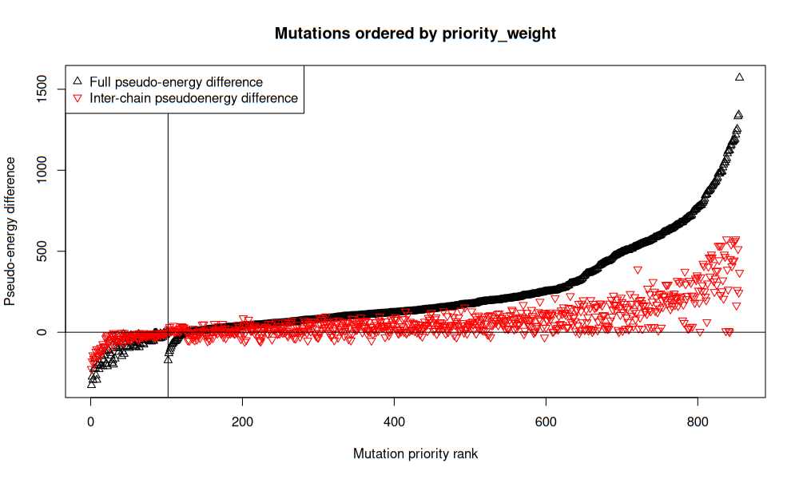
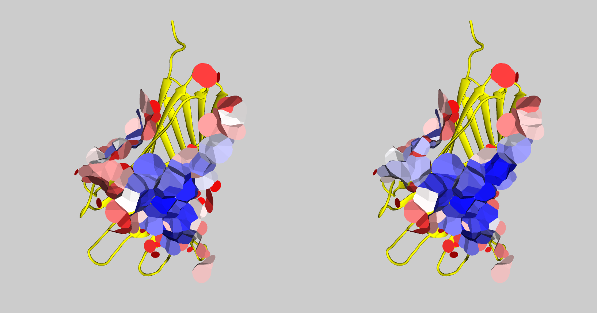

# Analyzing binders

Let's analyze three AF2 models of protein-protein complexes with designed binders in the [input directory](./input/).

We can run VoroMarmotte to get both global and inter-chain (ic_...) scores using a single command.
Let's tell VoroMarmotte to rebuild sidechains using FASPR, and let's consider only contacts involving the binder (chain A).

```bash
find ./input/ -type f -name '*.pdb' \
| ../../voromarmotte \
  --input _list \
  --rebuild-sidechains "true" \
  --subselect-contacts '[-a1 [-chain A]]' \
  --processors 3
```
This produces the following table:

```
ID           modified  pseudoenergy            area                  best_core_pseudoenergy  best_core_area        ic_fraction        ic_area_pseudoenergy  ic_area_total         ic_best_core_pseudoenergy  ic_best_core_area
design1.pdb  rebuilt   -11813.987477169581325  9349.444120000011026  -12266.914771829280653  9044.613930000010441  0.132961795807813  -420.466473588740143  1243.118879999999990  -716.137148729162845       855.597900000000323
design2.pdb  rebuilt   -9067.312684056138096   7375.054970000000139  -9778.557293821704661   6420.207669999997051  0.187249405681379  -314.328949022415713  1380.974660000000313  -886.622354313371943       688.603849999999852
design3.pdb  rebuilt   -233.506189086371705    2956.766829999999118  -1397.724229696076918   1608.509550000000445  0.426185899143085  609.737680109847361   1260.132329999999229  -395.248697797417776       490.549530000000118
```

The 'best_core_...' values show what scores can theoretically be achieved if sort the contact areas by their exposure to solvent and start removing them starting from the most exposed ones until we get the minimum pseudoenergy. Such 'best_core_...' values indicate how the 'rim' of contacts affect the overall stability and whether there is any potential for the improvement of pseudoenergy by mutating rim-involved parts.

Now, let us mutate every interface residue in to other 19 residues, rebuild the sidechains and score every mutant:

```bash
find ./input/ -type f -name '*.pdb' \
| ../../voromarmotte \
  --input _list \
  --subselect-contacts '[-a1 [-chain A]]' \
  --mutate-sidechains 'interface-A-every' \
  --output-table-file "./output/global_scores_mutated_to_every.txt" \
  --processors 16
```

We can look at the produces table [here](./output/global_scores_mutated_to_every.txt).
2283 mutants were generated and scored. The first several line of the generated table are shown below:

```
ID           modified                   pseudoenergy            area                  best_core_pseudoenergy  best_core_area        ic_fraction        ic_area_pseudoenergy  ic_area_total         ic_best_core_pseudoenergy  ic_best_core_area
design1.pdb  rebuilt_mutated_A_27_GLY   -12532.555925936905624  9367.673090000012962  -12985.214728326589466  9062.842900000008740  0.133084328202149  -540.007848967087966  1246.690479999999980  -824.881655245652610       859.169500000000198
design1.pdb  rebuilt_mutated_A_27_ARG   -12448.623039436673935  9297.473810000012236  -12908.871127233291190  8988.810330000007525  0.133514850954982  -491.959030355939888  1241.350830000000087  -780.605292799966719       869.480660000000285
design1.pdb  rebuilt_mutated_A_27_ALA   -12428.682085970200205  9366.841610000012224  -12881.340888359880410  9062.011420000009821  0.133096141891525  -530.231302543218476  1246.690479999999980  -816.693709970915847       859.169500000000198
design1.pdb  rebuilt_mutated_A_27_PRO   -12426.029520295023758  9369.463730000012220  -12878.688322684698505  9064.633540000009816  0.133090649148604  -515.298447911296648  1246.988010000000031  -811.231325556930756       859.467030000000250
design1.pdb  rebuilt_mutated_A_27_CYS   -12322.609522736334839  9364.442780000012135  -12775.268325126016862  9059.612590000009732  0.133130236287268  -493.931870717976096  1246.690479999999980  -791.136270779274241       859.169500000000198
design1.pdb  rebuilt_mutated_A_27_LEU   -12319.708139206615670  9365.614850000012666  -12772.366941596294055  9060.784660000010263  0.133032677507553  -492.480170592899924  1245.932819999999992  -777.122266346805645       858.411840000000325
design1.pdb  rebuilt_mutated_A_27_GLN   -12303.997420963338300  9351.514060000010431  -12755.485595339796419  9046.683870000008028  0.132901264118935  -531.687641681358627  1242.828040000000101  -807.702915390337466       855.307060000000206
design1.pdb  rebuilt_mutated_A_230_ARG  -12264.389310895036033  9345.285120000005918  -12718.298790669272421  9040.454930000008972  0.133277717480705  -411.602158933827582  1245.518270000000030  -717.295215726129754       857.997290000000248
design1.pdb  rebuilt_mutated_A_27_GLU   -12253.891485089958223  9350.032390000011219  -12705.379659466396333  9045.202200000008816  0.132930967311868  -526.258629425454842  1242.908850000000029  -803.845489610449476       855.387870000000134
design1.pdb  rebuilt_mutated_A_27_ILE   -12192.134058365469173  9366.959250000010798  -12645.197480391660065  9062.129060000008394  0.132983983035903  -465.205542266138139  1245.655549999999948  -750.785335123887421       858.134570000000281
design1.pdb  rebuilt_mutated_A_161_PHE  -12188.365874808883746  9346.755070000011983  -12576.470852193613609  9052.995770000010452  0.131885829977141  -531.967876730207990  1232.704550000000154  -759.522241830002486       855.162510000000339
````

On a single machine this "mutational scanning" can take several hours, so using a CPU cluster may be a good idea.
Instead of specifying `--mutate-sidechains 'interface-A-every'`,
we can mutate and score just one residue, e.g. `--mutate-sidechains 'A 74 TYR'` means that residue number 74 in chain A will be change.
We can also specify multiple mutations one after another, e.g. `--mutate-sidechains 'A 74 TYR A 108 PHE'`.
We can also mutate every chain A interface residue to a specific residue, e.g. `--mutate-sidechains 'interface-A-PHE'`.
So, to run on a cluster, we can list all the mutations we need and consider them in parallel.

When we have the `global_scores_mutated_to_every.txt` table, we can use the [suggest-mutations-to-increase-binding-stability](../../meta/suggest-mutations-to-increase-binding-stability) script to generate priority-ranked multi-point mutations for every input structure file, for example:

```bash
../../meta/suggest-mutations-to-increase-binding-stability \
  --input-table "./output/global_scores_mutated_to_every.txt" \
  --file-id "./input/design2.pdb" \
  --output-dir "./output/suggested_mutations_to_increase_binding_stability/design2"
```

This command generates multiple files in the provided directory path.
Firstly, the priority-sorted table of single-point mutations (e.g. [here](./output/suggested_mutations_to_increase_binding_stability/design2/mutations_table.tsv)). Secondly, the plot based on that table:



Most importantly, `suggest-mutations-to-increase-binding-stability` generates ordered list of multi-point mutations that involve the best-scored single-point mutations.
The generated "mutation requests" file can be viewed [here](./output/suggested_mutations_to_increase_binding_stability/design2/multiple_mutation_requests.txt), its several lines are presented below:

```
./input/design2.pdb A_76_LEU_A_123_ALA
./input/design2.pdb A_136_TRP_A_63_ARG
./input/design2.pdb A_123_GLN_A_63_ARG
./input/design2.pdb A_76_LYS_A_63_ARG
./input/design2.pdb A_76_LEU_A_63_ARG
./input/design2.pdb A_123_ALA_A_63_ARG
./input/design2.pdb A_76_TYR_A_104_ARG_A_63_ASP
./input/design2.pdb A_76_TYR_A_104_ARG_A_71_TYR
./input/design2.pdb A_76_TYR_A_104_ARG_A_136_TRP
./input/design2.pdb A_76_TYR_A_104_ARG_A_123_GLN
./input/design2.pdb A_76_TYR_A_63_ASP_A_71_TYR
./input/design2.pdb A_76_TYR_A_63_ASP_A_136_TRP
```

This file can be directly submitted to the VoroMarmotte application:

```bash
cat "./output/suggested_mutations_to_increase_binding_stability/design2/multiple_mutation_requests.txt" \
| ../../voromarmotte \
  --input _list \
  --mutate-sidechains _list \
  --subselect-contacts '[-a1 [-chain A]]' \
  --processors 16
```

which mutates and scores complexes and produces a standard VoroMarmotte output table - see the full file [here](./output/suggested_mutations_to_increase_binding_stability/design2/global_scores_mutated_multiple.txt) and the first several lines below:

```
ID           modified                                                                  pseudoenergy            area                  best_core_pseudoenergy  best_core_area        ic_fraction        ic_area_pseudoenergy  ic_area_total         ic_best_core_pseudoenergy  ic_best_core_area
design2.pdb  rebuilt_mutated_A_76_TYR_A_104_ARG_A_71_TYR_A_136_TRP_A_63_ARG            -10072.977058916800161  7474.325900000000729  -10706.417874422955720  6580.591979999998330  0.192314163073890  -768.462995708754647  1437.418730000000096  -1203.592083227764533      748.959890000000087
design2.pdb  rebuilt_mutated_A_76_TYR_A_104_ARG_A_71_TYR_A_136_TRP_A_123_GLN_A_63_ARG  -10058.651496518792555  7453.788109999997687  -10640.984698701513480  6557.243350000000646  0.191858134266175  -880.000236970762330  1430.069880000000012  -1249.008092058921193      987.315719999999828
design2.pdb  rebuilt_mutated_A_76_TYR_A_104_ARG_A_71_TYR_A_123_GLN_A_63_ARG            -10053.744597599850749  7432.677520000002005  -10647.027172267611604  6485.590130000003228  0.190390699205258  -817.909650417548960  1415.112670000000207  -1196.969177026752277      739.474959999999896
design2.pdb  rebuilt_mutated_A_76_TYR_A_104_ARG_A_71_TYR_A_136_TRP_A_123_ALA_A_63_ARG  -10041.131503162931040  7437.991549999996096  -10667.952432597900042  6468.821820000001935  0.192320487376730  -884.672832244164056  1430.478159999999889  -1250.737315418982917      987.723999999999819
design2.pdb  rebuilt_mutated_A_76_PHE_A_104_ARG_A_71_TYR_A_136_TRP_A_63_ARG            -10017.251467556832722  7466.899329999998372  -10650.405747300237635  6573.165409999997792  0.191087722887514  -721.608774663009967  1426.832790000000159  -1157.851070957284946      738.350399999999922
design2.pdb  rebuilt_mutated_A_76_PHE_A_104_ARG_A_71_TYR_A_136_TRP_A_123_GLN_A_63_ARG  -10003.267329194008198  7446.369919999998274  -10585.278305463565630  6549.825159999999414  0.190627573603005  -833.030662780472767  1419.483430000000226  -1202.732806660737197      976.737369999999828
design2.pdb  rebuilt_mutated_A_76_TYR_A_104_ARG_A_71_TYR_A_136_TRP                     -9999.430008852796163   7472.027080000001661  -10629.276828845569980  6578.293159999998352  0.192307481572992  -774.992896203571945  1436.926709999999957  -1193.450914613606528      750.826570000000061
design2.pdb  rebuilt_mutated_A_76_PHE_A_104_ARG_A_71_TYR_A_123_GLN_A_63_ARG            -9998.428821496818273   7425.259330000002592  -10592.442260838462971  6478.180040000002009  0.189155173924410  -771.019672434595464  1404.526220000000421  -1151.832742545582050      728.868110000000001
design2.pdb  rebuilt_mutated_A_76_TYR_A_71_TYR_A_136_TRP_A_123_ALA_A_63_ARG            -9994.942440737517245   7378.858079999998154  -10585.744935030232227  6402.830190000000584  0.187863642987968  -853.698983515217833  1386.219160000000102  -1191.888099033316394      914.756469999999922
design2.pdb  rebuilt_mutated_A_104_ARG_A_71_TYR_A_136_TRP_A_76_LEU_A_63_ARG            -9987.510002839051594   7445.622359999994842  -10587.588862874237748  6555.256899999999405  0.190642653007183  -810.659072220080702  1419.453199999999470  -1186.707577182664863      952.393159999999966
```

Interestingly, mutations have improved the inter-chain VoroMarmotte scores significantly compared to the non-mutated scoring result shown below:

```
ID           modified                   pseudoenergy       area        best_core_pseudoenergy  best_core_area  ic_fraction        ic_area_pseudoenergy  ic_area_total  ic_best_core_pseudoenergy  ic_best_core_area
design2.pdb  rebuilt   -9067.312684056138096   7375.054970000000139  -9778.557293821704661   6420.207669999997051  0.187249405681379  -314.328949022415713  1380.974660000000313  -886.622354313371943       688.603849999999852
```

Also interestingly, the interface in `design2.pdb` was improved more then the inerface in `design1.pdb` that was initially assessed to be better.
Below are the scores of the several best found mutations for those designs:

```
ID           modified                                                                  pseudoenergy            area                  best_core_pseudoenergy  best_core_area        ic_fraction        ic_area_pseudoenergy  ic_area_total         ic_best_core_pseudoenergy  ic_best_core_area
design2.pdb  rebuilt_mutated_A_76_TYR_A_104_ARG_A_71_TYR_A_136_TRP_A_63_ARG            -10072.977058916800161  7474.325900000000729  -10706.417874422955720  6580.591979999998330  0.192314163073890  -768.462995708754647  1437.418730000000096  -1203.592083227764533      748.959890000000087
design2.pdb  rebuilt_mutated_A_76_TYR_A_104_ARG_A_71_TYR_A_136_TRP_A_123_GLN_A_63_ARG  -10058.651496518792555  7453.788109999997687  -10640.984698701513480  6557.243350000000646  0.191858134266175  -880.000236970762330  1430.069880000000012  -1249.008092058921193      987.315719999999828
design2.pdb  rebuilt_mutated_A_76_TYR_A_104_ARG_A_71_TYR_A_123_GLN_A_63_ARG            -10053.744597599850749  7432.677520000002005  -10647.027172267611604  6485.590130000003228  0.190390699205258  -817.909650417548960  1415.112670000000207  -1196.969177026752277      739.474959999999896
design2.pdb  rebuilt_mutated_A_76_TYR_A_104_ARG_A_71_TYR_A_136_TRP_A_123_ALA_A_63_ARG  -10041.131503162931040  7437.991549999996096  -10667.952432597900042  6468.821820000001935  0.192320487376730  -884.672832244164056  1430.478159999999889  -1250.737315418982917      987.723999999999819

ID           modified                                                                  pseudoenergy            area                  best_core_pseudoenergy  best_core_area        ic_fraction        ic_area_pseudoenergy  ic_area_total         ic_best_core_pseudoenergy  ic_best_core_area
design1.pdb  rebuilt_mutated_A_27_GLY_A_161_PHE                                        -12906.934323576208044  9364.984040000013920  -13294.770808690922422  9071.224740000008751  0.132010491926049  -651.509252108555870  1236.276150000000143  -868.266748346492136       858.734110000000214
design1.pdb  rebuilt_mutated_A_27_GLY_A_161_TRP                                        -12888.599887067235613  9389.009060000011232  -13289.970369464957912  9086.305280000013227  0.133837579873418  -658.719814103794192  1256.602250000000140  -868.762343293377285       863.798480000000154
design1.pdb  rebuilt_mutated_A_27_GLY_A_161_TYR                                        -12833.756254170408283  9366.152270000011413  -13238.944934563060087  9072.370830000007118  0.131966423817280  -626.749244911482037  1236.017620000000079  -852.681480887619841       861.847740000000158
design1.pdb  rebuilt_mutated_A_27_GLY_A_227_TRP                                        -12829.810084699209256  9390.717750000008891  -13215.141343052955563  9109.170920000007754  0.134277491196027  -676.309906421061783  1260.962020000000166  -882.917579110021279       893.272600000000125
```

We can also run VoroMarmotte to generate files to visualize the interface of the most interesting mutant, for example:

```bash
../../voromarmotte \
  --input "./input/design2.pdb" \
  --mutate-sidechains "A_76_TYR_A_71_TYR_A_123_GLN" \
  --subselect-contacts '[-inter-chain]' \
  --output-vscript "show.vs" \
  --output-pymol-vscript "show.py" \
  --output-atoms-file "mutant_atoms.pdb" \
> "interface_scores.txt"
```

Below are `design2.pdb` interfaces before and after the mutations, showed together with chain A and colored by pseudo-energy - blue for negative (good), red for positive (bad):



Obviosly, we cannot expect to turn every contact blue with just three mutations - more mutations can help, although we probably must be cautious to not break the structure with them.

